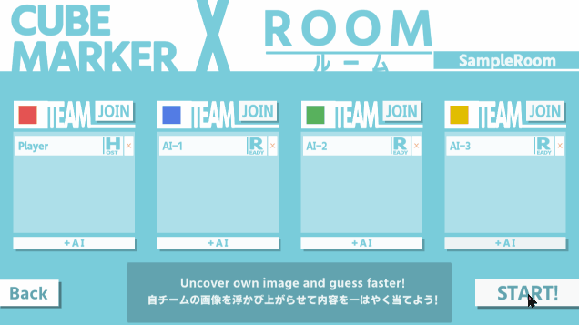
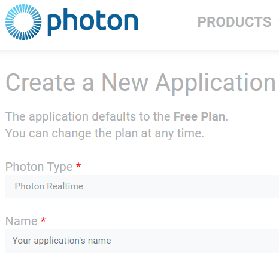
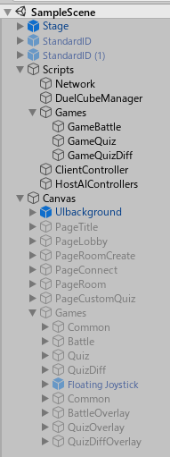

# toio-cube-marker

 

これは [**toio SDK for unity**](https://github.com/morikatron/toio-sdk-for-unity)（バージョン1.3.0）を利用したサンプルプログラムです。最大4人のプレイヤーが、一つのフィールド上に置かれた toio™コアキューブ（以降キューブ）を操縦し、色を塗る面積を競ったり、画像を掻き出してそこに描かれた内容を解答するゲームです。

#### ３つのゲームモード
- **`Battle`** ：キューブを走らせて色を塗り、指定した時間内で塗った面積を競い合うゲームです。
- **`Image Quiz`** ：キューブを走らせることで、浮かび上がる画像の内容をあてるクイズゲームです。対戦側のチームがその邪魔をしてきます。(回答のチャンスは1回のみ)
- **`Multi-Image Quiz`** ：チーム毎に異なる画像を浮かび上がらせ、その内容をあてるクイズゲームです。(回答のチャンスは1回のみ)

#### 主な特徴
- 最大４人のプレイヤーがオンラインで遊ぶことが可能です。
- ゲームのルームを作成する際、シミュレーターとリアルキューブのどちらでもゲームをホストすることができます。
- リアルのキューブを使って遊ぶ際はゲーム画面を表示するモニターの上に、簡易マットを敷くことで、リアルな「色塗り」を体験できます。
- `Image Quiz` と `Multi-Image Quiz` では自分な好きな画像でゲームをカスタマイズすることができます。
- (開発者向け) インターフェイスを継承する形で、AI プレイヤーを簡単にカスタマイズできます。

> ※「簡易マット」の正式名称は「toio™コア キューブ（単体）付属の簡易プレイマット」です。

## 動作環境

> toio SDK for Unity 1.3.0 と一致しています。

- Unity（2019.4.0f1 LTS 推奨）
- Mac（macOS ver.10.14以上）
- Windows 10（64 ビット版のみ）
- iOS端末（iOS ver.12以上）
- Android端末（Android OS 9.0以上）

リアルキューブで遊ぶ場合
- toio™コア キューブ 1~4台
- 簡易マット
- （オプション）モニター

## セットアップ

- Unity Hub で「リストに追加」ボタンを押して、ダウンロードされたフォルダの下にある「toio-cube-marker」フォルダを選択してください。
- リストに表示された「toio-cube-marker」をクリックしてプロジェクトを開きます。
- エディタの「プロジェクト」で「Assets/toio-cube-marker/Scenes/Scene.unity」をクリックしてシーンを開きます。
  - 「TMP Importer」というダイアログが表示されると、「Import TMP Essentials」を押してください。

### Unity プロジェクトのセットアップ

以下のパッケージを入手してインポートしてください。

- **TextMeshPro**：高度な制御ができるテキストアセット
  - 前述通りにシーンを初めて開く時に「TMP Importer」というダイアログでインポートできます。
  - もしくは Package Manager で「TextMeshPro」で検索してインポートします。(検索の範囲を「Unity Registry」に切り替えてください)
- **toio SDK for unity**：toio™コアキューブを制御するためのSDK (対応バージョン 1.3.0)
  - [【こちら】](https://github.com/morikatron/toio-sdk-for-unity/releases/tag/v1.3.0) からバージョン 1.3.0 のunityパッケージをダウンロードしてください。
  - [【ドキュメント】](https://github.com/morikatron/toio-sdk-for-unity/tree/v1.3.0/docs/download_sdk.md#unitask-%E3%81%AE%E3%82%A4%E3%83%B3%E3%82%B9%E3%83%88%E3%83%BC%E3%83%AB) を参考にして、Unitask と toio SDK for unity をインポートしてください。
  - Mac で BLE Plugin を使う場合は、[【こちら】](https://github.com/morikatron/toio-sdk-for-unity/tree/v1.3.0/docs/usage_macble.md) を参考にしてセットアップしてください。
- **Photon 2 - Free**：ネットワークエンジン (テスト済みバージョン 2.30.0)
  - [【こちら】](https://assetstore.unity.com/packages/tools/network/pun-2-free-119922) からインポートしてください。
  - Photon を使うには、事前に AppID を取得して設定する必要があります、[【こちら】](https://doc.photonengine.com/en-us/pun/current/demos-and-tutorials/pun-basics-tutorial/intro#let_s_go__importing_pun_and_setup) を参考にしてください。
    - Photon をインポートする際に表示されたダイアログにメールアドレスを入力すると、AppID が自動的に発行されます。
    - Photon のウェブページ上でログインして、ダッシュボードで「CREATE A NEW APP」で AppID を取得することもできます。(タイプは「Realtime」です)
 

  - AppID の設定は上記ダイアログの他、「Photon/PhotonUnityNetworking/Resources/PhotonServerSettings」で設定することもできます。
  - 上記「PhotonServerSettings」で、サーバー地域を指定することをおすすめします（日本の場合は「jp」）。指定しない場合は、アプリ実行時のネット環境によって違うサーバーに自動配分される可能性があります。
- **Joystick Pack**：バーチャルジョイスティックを簡単に実装できるアセット (テスト済みバージョン 2.1.0)
  - [【こちら】](https://assetstore.unity.com/packages/tools/input-management/joystick-pack-107631) からインポートしてください。
- **WebGLInput**() : WebGLのビルドで、コピー・ペーストを可能にするアセット
  - [【こちら】](https://github.com/kou-yeung/WebGLInput/releases) からインポートしてください。
  - ビルド先にWebGLを指定する際、必要となります。
  - このアセットを使わなくてもエラーは出ませんので、インストールしても、しなくてもかまいません。

### リアル環境のセットアップ

リアルの簡易マットで「色塗り」視覚体験を実現する方法を説明します。

必要なもの
- リアルキューブ 1~4 台
- 簡易マット （他のマットを利用するには、ソースコードを変更する必要があります）
- モニター

手順
- モニターを水平にします。
- モニターの上に（なるべく中央に）簡易マットを敷きます。
- 画面ミラーリングなどの機能を利用して、ゲーム画面をモニターに表示させます。
- アプリを起動し、キューブ接続・校正画面でリアルキューブを接続した後、校正を行い、モニター上表示されたマットとリアルの簡易マットとを一致させます。
- リモートの友達と対戦の場合は、ウェブカメラでリアル環境の映像を共有するのも良いです。
- ルーム作成してゲームを開始し、リアルのキューブと簡易マットに透けて見える「色/画像」を見ながら遊びます。

## 構成説明

本サンプルのシーンファイルは一つだけ（ /Assets/toio-cube-marker/Scenes/Scene.unity ）です。　　

シーンのヒエラルキーは以下になります。`Scripts` と `Canvas` それぞれに UI 以外のスクリプトと UI 関連のスクリプトが当てられています。

以下簡単に `Scripts` の中身を説明します。
- Network (`NetworkManager.cs`)：Photon サーバーからの情報をまとめて持ちます。
- DuelCubeManager (`DuelCubeManager`)：シミュレータとリアル両方のキューブを管理します。
- Games：各ゲームの実装（ホストとクライアント両方）を持っています。
- ClientController：クライアント側の操作を取り入れるコンポーネントを持っています。
- HostAIControllers：ホスト側が作る AI プレイヤーを実装したコンポーネントを持っています。

本サンプルは、シーン遷移を使わずに、一つのシーンで複数の UI を切り替える方式を採用しています。
`Canvas` 下には各ページの UI が羅列されています。
- Canvas (`UICommon.cs`)：ページの切り替え機能を担当
  - PageTitle (`UITitle.cs`)：タイトル画面
  - PageLobby (`UILobby.cs`)：ルーム一覧
  - PageRoomCreate (`UIRoomCreate.cs`)：ルーム作成画面
  - PageConnect (`UIConnect.cs`)：リアルキューブを使用してルームを作成する場合、接続と校正を行う画面
  - PageRoom (`UIRoom.cs`)：ルーム画面
  - PageCustomQuiz (`UICustomQuiz.cs`)：Quiz や QuizDiff のゲームで使われる画像をカスタマイズする画面
  - Games (`UIGame.cs`)：各ゲームの共通 UI を管理
    - Common：バックグラウンド、フィルド、キューブマーカーなどの共通 UI
    - Battle/Quiz/QuizDiff (`UIGameBattle.cs` など)：ゲーム毎の UI を管理
    - Floating Joystick：ジョイスティック
    - Common：バックボタンなど、上層にある共通 UI
    - BattleOverlay/QuizOverlay/QuizDiffOverlay：結果表示などのゲーム毎の UI

#### ゲーム実装の構成

バトルゲームを例とします。

バトルの UI の有効化によって、`UIGameBattle.cs` がゲーム実装 `GameBattleHost.cs` `GameBattleClient.cs` の開始メソッドを呼び、バトルゲームが始まります。

ホストコード `GameBattleHost.cs` は
- `DuelCubeManager.cs` を利用し、キューブを用意してプレイヤーと関連付けます。
  - クライアントからの命令をキューブに送信
  - キューブの情報をクライアントに送信
- ゲームの進行を管理し、クライアントに通知
- HostAIControllers 上のコンポネントから生成した AI の行動をキューブに適用

クライアントコード `GameBattleClient.cs` は
- インターフェイス方式で、`UIGameBattle.cs` にマーカーを用意させてプレイヤーと関連付けます。
  - ホストからのキューブ情報をマーカーに反映
- ClientController 上のコンポーネントから読み取った操作情報を、ホストに送信
- クイズ回答などの情報をホストに送信

#### AI プレイヤーのカスタマイズ

`ConAIRandom.cs` のように、インターフェイス `IController` と `ControllerBase` を継承してクラスを実装すれば、カスタム AI プレイヤーを作れます。

自作の `IController` を利用する場合、`HostAIControllers` オブジェクトに、元のコンポーネントを削除して自作のスクリプトを追加すれば良いです。
ゲームでは、AI の数が最大3台になります。
また、AI プレイヤーは番号を持ち、`HostAIControllers` に追加された同じ順番の `IController` コンポーネントを実行します。
したがって、`HostAIControllers` には常に3つのコンポーネントを保持すると良いと思います。

キーボードやジョイスティックの操作を取り入れるクラスは、同じく `IController` を継承していますので、
AI プレイヤーを手動化、あるいはクライアントを AI 化するのも可能です。

## 注意事項

WebGL ビルドの場合、カスタムクイズで URL で画像をダウンロードすると CORS エラーが発生しますので、CORS 回避の対策が必要となります。

## 利用したもの

以下のものをご利用させていただきました。

- [Photon 2 - Free](https://assetstore.unity.com/packages/tools/network/pun-2-free-119922)
- [Joystick Pack](https://assetstore.unity.com/packages/tools/input-management/joystick-pack-107631)
- [WebGLInput](https://github.com/kou-yeung/WebGLInput/releases)
- [源暎Nuゴシック](https://okoneya.jp/font/genei-nu-gothic.html) (Font)
- [いらすとや](https://www.irasutoya.com/) (クイズ用の画像素材)
